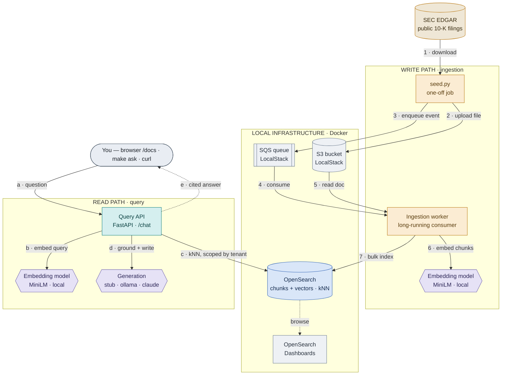

# edgar-rag

A small, runnable **RAG (Retrieval-Augmented Generation)** pipeline over public
**SEC filings**. It downloads company annual reports, indexes them into a vector
store, and answers questions about them with citations back to the source —
runnable locally in Docker, with no cloud credentials by default.

## What it accomplishes

It demonstrates, on public data, how a document-RAG pipeline is built end to end:

```
download → parse → chunk → embed → store → retrieve → answer (with citations)
```

The emphasis is the **ingestion (write) path** — the under-appreciated half of
RAG: reliably getting messy documents *in*, parsed, chunked, embedded, and
searchable. It's a portfolio project, built up gradually in the open.

## System map

Numbers `1–7` trace the write path; letters `a–e` trace the read path. The two
pipelines only meet at OpenSearch — one fills it, the other queries it.



## Enterprise-grade

The intent is to show the engineering that real, multi-tenant RAG systems
require — the same architecture and stack you'd run in production, on public
data and runnable on a laptop:

- **Event-driven ingestion** (queue → worker): bounded concurrency, back-pressure, graceful shutdown
- **Multi-tenant isolation**: retrieval scoped so one customer never sees another's documents
- **Data integrity**: every chunk embedded (no silent drops), malformed input rejected at the edge
- **Operability**: distributed tracing, context-window & throttling guardrails, load tests (p99, time-to-first-token)
- **Swappable model backends** (local ↔ cloud) behind clean interfaces
- **Engineering rigor**: unit tests, CI, and pre-commit gates

These pieces are added gradually — see the commit history and `docs/`.

## Where the documents come from

All source material is downloaded from **SEC EDGAR** — the U.S. Securities and
Exchange Commission's free, public database of company filings
(<https://www.sec.gov/edgar>). Nothing proprietary is used; SEC filings are
public domain.

Specifically, the seeder pulls **10-K filings** — a public company's **annual
report** (business overview, risk factors, financial statements). They're long,
messy, unstructured HTML documents, which makes them a realistic RAG input.

How they're fetched (no account or API key required):

1. Resolve a ticker (e.g. `AAPL`) to its **CIK**, the SEC's company id, via
   SEC's public `company_tickers.json`.
2. Look up the company's most recent **10-K** through SEC's submissions API.
3. Download that filing's primary document from the EDGAR archive.

SEC asks callers to identify themselves with a descriptive `User-Agent` (with
contact info); the seeder sends one, configurable via `EDGAR_RAG_SEC_USER_AGENT`.

## Status

🚧 Built gradually — see the commit history for progress.

## License

MIT — see [LICENSE](LICENSE).
