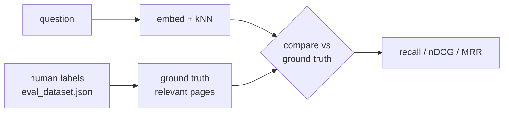

# eval — retrieval evaluation (human-in-the-loop)

Measures how good retrieval is, using metrics computed against **ground-truth
labels that a human writes by hand**. The search engine's own `_score` can't tell
you if the *right* chunk came back — only a labeled answer key can.



## Human in the loop

The evaluation is only as trustworthy as its labels, and the labels are
**authored by a person**, not inferred by the system. In `eval_dataset.json` a
human writes both the corpus and, for each question, which page answers it:

```json
{ "question": "What are the main risk factors?",
  "relevant": [{ "document_id": "ACME-10K-2023", "page_number": 1, "grade": 3 }] }
```

That `relevant` list is the answer key. The harness never guesses it — it holds
this human ground truth aside and checks the system's results against it.

## Recall (`recall@k`)

**Question it answers:** of the pages a human marked relevant, how many did search
actually return in the top *k*?

```
recall@k = |relevant pages found in top-k| / |relevant pages total|
```

- `relevant_ids` = the `(document_id, page_number)` pairs from the human labels.
- Take the top-k retrieved chunks, look at their `(document_id, page_number)`.
- Recall = fraction of the labeled-relevant pages that appear.

`1.0` = every relevant page was found; `0.0` = none. It measures **coverage**
(did we find it at all) and ignores ordering — nDCG and MRR cover position.

Example: relevant = `{(ACME,1)}`, top-5 includes `(ACME,1)` → recall = `1.0`.

## DCG (Discounted Cumulative Gain)

**The human's part first:** recall only needs "relevant or not". DCG needs one
thing more from the human — a **grade** of *how* relevant, written in the labels:

```json
"relevant": [{ "document_id": "ACME-10K-2023", "page_number": 1, "grade": 3 }]
```

`3` = perfect answer, `2` = strong, `1` = partial, `0` = irrelevant (unlabeled).
So the human supplies not just *which* pages count but *how much* each counts.

**Question it answers:** did the higher-graded pages land near the top?

```
dcg = grade[0] + sum(grade[i] / log2(i + 1) for i in 1..k)
```

- `grade[i]` = the human grade of the *i*-th retrieved chunk's page (`0` if unlabeled).
- Each result is **discounted by its position** — deeper results count for less.

So DCG rewards two things at once: retrieving high-graded pages, and ranking them
**high**. The same items score more when the best one is first.

Example: grades in returned order `[3, 1]` → `3 + 1/log2(2)` = `4.0`.

DCG alone isn't 0–1 or comparable across queries — nDCG fixes that by dividing by
the best possible DCG (a perfect ranking).

## nDCG (`ndcg@k`)

**Question it answers:** out of the best ranking that was possible, how close did
we get? — on a comparable `0`–`1` scale (`1.0` = perfect order, `0.0` = nothing
relevant found).

**The human's part:** nDCG uses the same human `grade`s (0–3) **twice** — once for
our ranking, once to build the ideal one:

```
nDCG@k = DCG(our order) / DCG(ideal order)
```

```python
idcg = dcg(sorted(ideal_gains, reverse=True), k)  # human grades sorted = perfect ranking
return dcg(ranked_gains, k) / idcg                # human grades in OUR order = what we got
```

- `ranked_gains` = human grades of the retrieved pages, in the order search returned them.
- `ideal_gains` = the same grades, sorted high→low, to form the best possible ranking.

So the human's grades define **both** what we scored and the perfect score it is
measured against. Dividing makes it comparable across queries, so they can be
averaged.

Example: ideal `[3, 2, 1]`, we return `[1, 2, 3]` → `4.90 / 5.63` ≈ `0.87`
(relevant pages present, but ordered badly).

## MRR (reciprocal rank)

**Question it answers:** how soon does the first relevant result show up? Users
read top-down and want a good answer fast.

```
reciprocal_rank = 1 / (position of the first relevant result)
```

- Position 1 → `1.0`, position 2 → `0.5`, position 3 → `0.33`, none → `0.0`.
- Only the **first** hit matters; everything after it is ignored.
- **MRR** = the mean of this across all queries.

**The human's part:** the labels define what counts as relevant. Here the human
`grade` is used only as a **yes/no** (`grade > 0`) — the size (1 vs 3) doesn't
matter, only whether the human marked the page relevant at all:

```python
for i, grade in enumerate(ranked_relevance):
    if grade > 0:              # "relevant" = a human labeled this page
        return 1.0 / (i + 1)
```

Example: human marked `(ACME,1)` relevant; search returns `[(GLOBEX,3), (ACME,1), …]`
→ grades `[0, 3, …]` → first relevant at position 2 → `0.5`.

See `metrics.py` for the implementation and `harness.py` for how retrieval output
is scored against the labels.
