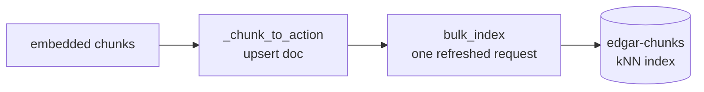

# search — OpenSearch write path

Turns embedded chunks into searchable documents. After a chunk is parsed →
chunked → embedded, it lands here to be indexed as a `knn_vector`, so the query
path can later find the chunks closest to a question by similarity.

This package is the **write** side only (connect, create index, bulk-index).
The kNN query itself (the read side) lives in the query step.

## What each piece does

| Function | Role |
|----------|------|
| `KnnConfig` | Bundles the vector-index knobs (`dim`, `engine`, `space_type`, `m`, `ef_construction`); `from_settings()` reads them from config |
| `build_client` | Opens an OpenSearch client from settings (no auth locally; flip `use_ssl` for prod) |
| `index_mapping` | The index definition — scalar filter fields, `text`, `flat_object` metadata, and the `knn_vector` |
| `ensure_index` | Creates the index once if missing (idempotent); returns `True` only on first creation |
| `bulk_index` | Upserts all chunks in one request; refuses a chunk with no embedding |

## Note: what HNSW is, and the two tuning knobs

The `embedding` field is indexed with **HNSW** (Hierarchical Navigable Small
World) — the algorithm that finds "the vectors closest to this one" fast.

Comparing a query against *every* stored vector is slow and gets worse as data
grows. HNSW instead builds a **graph of shortcut links** between nearby vectors
(with a few long-range "express" links on top). A search hops node-to-node,
always stepping toward the query, and reaches the closest matches after checking
only a tiny fraction of all vectors. The catch: it is **approximate** — usually,
but not provably, the true nearest neighbours — in exchange for large speedups.

Two knobs (in `config.py`, surfaced via `KnnConfig`) trade accuracy against
cost:

- **`hnsw_m` (default 16)** — how many neighbour links each vector keeps.
  Higher → richer graph → better recall, but more memory and a larger index.
- **`hnsw_ef_construction` (default 128)** — how hard it searches for good
  neighbours *while building* the index. Higher → a better-wired graph → better
  recall later, but slower to build. Costs build time only, not query time.

Rule of thumb: turn both up for higher recall at the cost of memory/build time;
the defaults are a balanced middle ground. `space_type` is `cosinesimil` because
our embeddings are L2-normalized, and `engine` is `lucene` since it ships with
OpenSearch (no extra plugin).

## Note: multi-tenancy is a shared index + filter

All tenants' chunks live in **one** index (`edgar-chunks`), each document
stamped with a `tenant` field. Isolation is enforced at **query time**: every
search filters to the caller's tenant before ranking, so a tenant can never
retrieve another's data. (The alternative — a separate index per tenant — gives
physical isolation but multiplies indexes/shards as tenants grow.) Because
isolation is logical, the tenant filter must be centralized and always-on in the
query path, never left to callers.

## Design guardrails

- **Refuse chunks with no embedding** — an unembedded chunk is invisible to kNN,
  so `bulk_index` raises rather than silently indexing an unsearchable document.
- **Stable `_id = chunk_id` + upsert** — re-indexing a chunk merges in place
  (no duplicates), and a later co-writer's fields survive a re-ingest.
- **`dim` must match the embedder** — 384 for MiniLM; the index is built from
  `KnnConfig`, never a hard-coded width.
